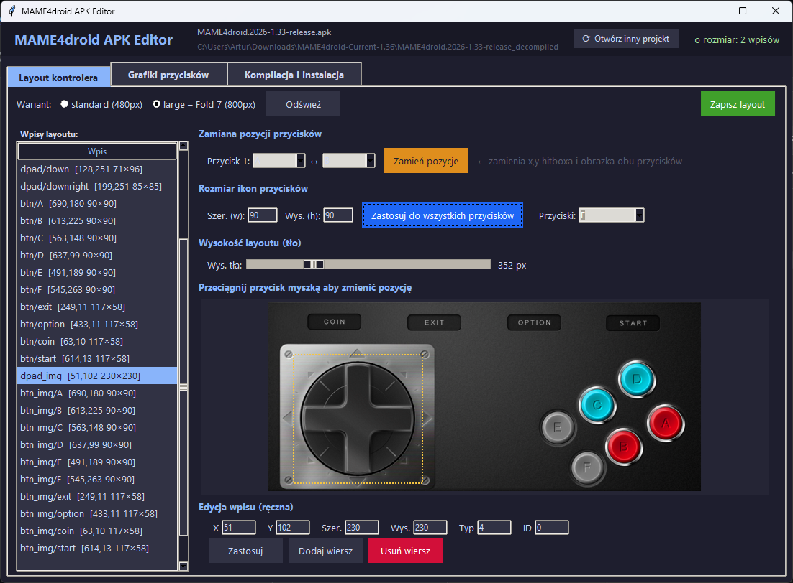

<div align="center">


# MAME4droid APK Editor

**Graficzny edytor layoutów i grafik kontrolera dla MAME4droid na Androida**




</div>

---

## Funkcje

- **Dekompilacja i kompilacja APK** — apktool, zipalign, apksigner wbudowane — brak zewnętrznych zależności
- **Edytor layoutu kontrolera** — przeciąganie przycisków myszką, zmiana rozmiaru, zamiana pozycji
- **Podgląd na żywo** — canvas z tłem `back_portrait.png`, skalowanie do rozmiaru PNG
- **Grafiki przycisków** — podgląd, import i eksport PNG dla wariantu `drawable` i `drawable-large` (Fold 7)
- **Generator przycisków 3D** — sferyczny przycisk z wyborem koloru, rozmiaru, obramowania i napisu
- **Generator tła kontrolera** — jednolite tło z gradientem dla obu wariantów
- **Kompilacja i instalacja** — pipeline jednym kliknięciem: apktool → zipalign → apksigner → adb install

---

## Uruchomienie (EXE)

> Nie wymaga Pythona ani żadnych dodatkowych instalacji.

1. Pobierz i rozpakuj archiwum
2. Uruchom `MAME4droid_Editor.exe`
3. W kreatorze startowym wskaż plik `.apk` — zostanie automatycznie zdekompilowany
4. Edytuj layout i grafiki, skompiluj i zainstaluj na urządzeniu

---

## Uruchomienie ze źródeł

**Wymagania:**
- Python 3.10+
- `pip install pillow`

```bash
python mame4droid_editor.py
```

**Budowanie EXE** (wymaga PyInstaller):

```powershell
.\build.ps1
```

---

## Struktura projektu

```
MAME4droid_Editor/
├── MAME4droid_Editor.exe   # Gotowy plik wykonywalny
├── mame4droid_editor.py    # Kod źródłowy
├── build.ps1               # Skrypt budowania EXE
├── icon.png / icon.ico     # Ikona aplikacji
└── tools/
    ├── jre/bin/java.exe    # Wbudowany Java Runtime
    ├── apktool.jar         # Dekompilacja/kompilacja APK
    ├── zipalign.exe        # Wyrównanie APK
    ├── adb.exe             # Android Debug Bridge
    └── lib/apksigner.jar   # Podpisywanie APK
```

---

## Narzędzia wbudowane

| Narzędzie | Wersja | Przeznaczenie |
|-----------|--------|---------------|
| apktool | 2.x | Dekompilacja i rekompilacja APK |
| OpenJDK JRE | 17 | Uruchamianie narzędzi Java |
| zipalign | — | Wyrównanie zasobów APK |
| apksigner | — | Podpisywanie APK kluczem |
| adb | — | Instalacja na urządzeniu Android |

---

## Wymagania systemowe

- Windows 10/11 (x64)
- Android z włączonym `USB Debugging` (do instalacji przez ADB)
- Klucz podpisywania `.jks` (wymagany przy pierwszym uruchomieniu)

---

<div align="center">
  Stworzony z myślą o modowaniu <a href="https://github.com/cast-tech/mame4droid">MAME4droid</a>
</div>
